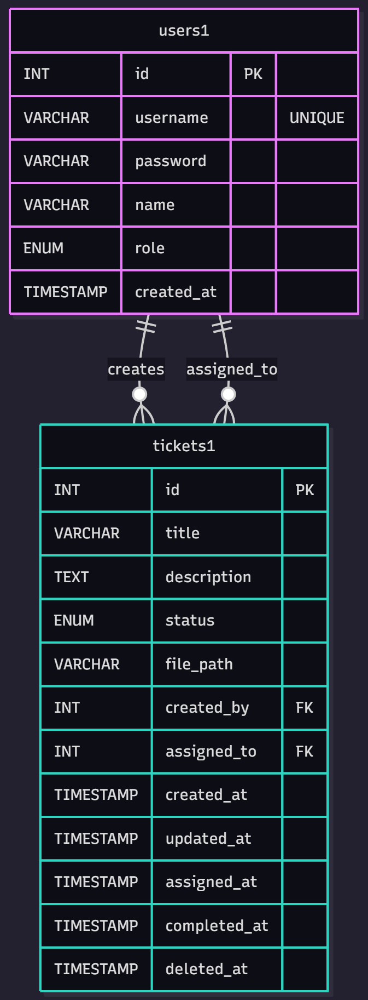
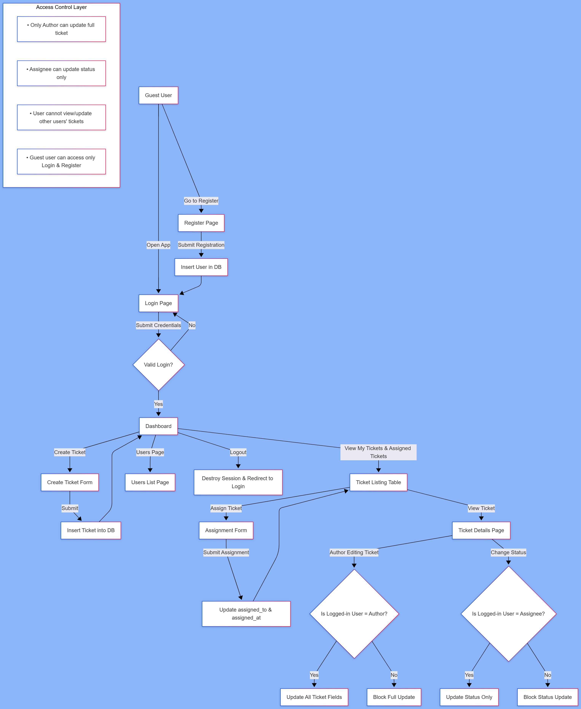

<h2>PHP CRM Ticket Module</h2>

<h3>📁 Project Directory Structure</h3>
<pre>CRM_Ticket_Module/
├── backend/
│   ├── auth_login.php
│   ├── auth_logout.php
│   ├── auth_register.php
│   ├── ticket_create.php
│   ├── ticket_update.php
├── database/
│   ├── db.php
│   ├── schema.sql
├── frontend/
│   ├── includes/
│   │   ├── footer.php
│   │   ├── header.php
│   ├── create_ticket.php
│   ├── index.php
│   ├── login.php
│   ├── register.php
│   ├── users.php
│   ├── view_ticket.php
</pre>

<h3>⚙️ Installation Manual</h3>
<pre>
1.	Move the project folder: Copy the CRM_Ticket_Module directory into your local web server directory. For example, use **xampp/htdocs/CRM_Ticket_Module (XAMPP)** **or wamp64/www/CRM_Ticket_Module (WAMP)**.
2.	Create the database: In your MySQL server (e.g., using phpMyAdmin or the MySQL CLI), create a new database named **crm_ticket_db**.
3.	Import the schema: Import the **database/schema.sql** file into the crm_ticket_db database to create the necessary tables and initial data.
4.	Configure database connection: Open **database/db.php** and update the MySQL credentials (hostname, username, and password) to match your local setup.
5.	Launch the application: Open your web browser and navigate to **http://localhost/frontend/login.php** to access the CRM Ticket Module login screen. From there, you can register a new user or log in to start creating and managing tickets.
With these steps completed, your CRM Ticket Module should be up and running on your local machine.
</pre>

<h3>🧱 Database Layout</h3>

<h4>The system uses two tables:</h4>
<ul>
  <li>users1: Stores user credentials and roles</li>
  <li>tickets1: Stores all ticket-related data</li>
</ul>
<h4>Each ticket is linked to:</h4>
<ul>
  <li>its creator (created_by)</li>
  <li>its assignee (assigned_to)</li>
</ul>

This enforces relational integrity and allows per-user filtering in queries.

<!-- 

  

 -->

  

    
  

<h3>🔗 Entity Relationship Diagram (ERD)</h3>

The users1 table has a one-to-many relationship with the tickets1 table in two directions:

<ul>
  <li>One user can create multiple tickets (created_by)</li>
  <li>One user can be assigned multiple tickets (assigned_to)</li>
</ul>

Role-based access is determined via the role column in users1.

<!-- 

  

 -->

  

    
  

